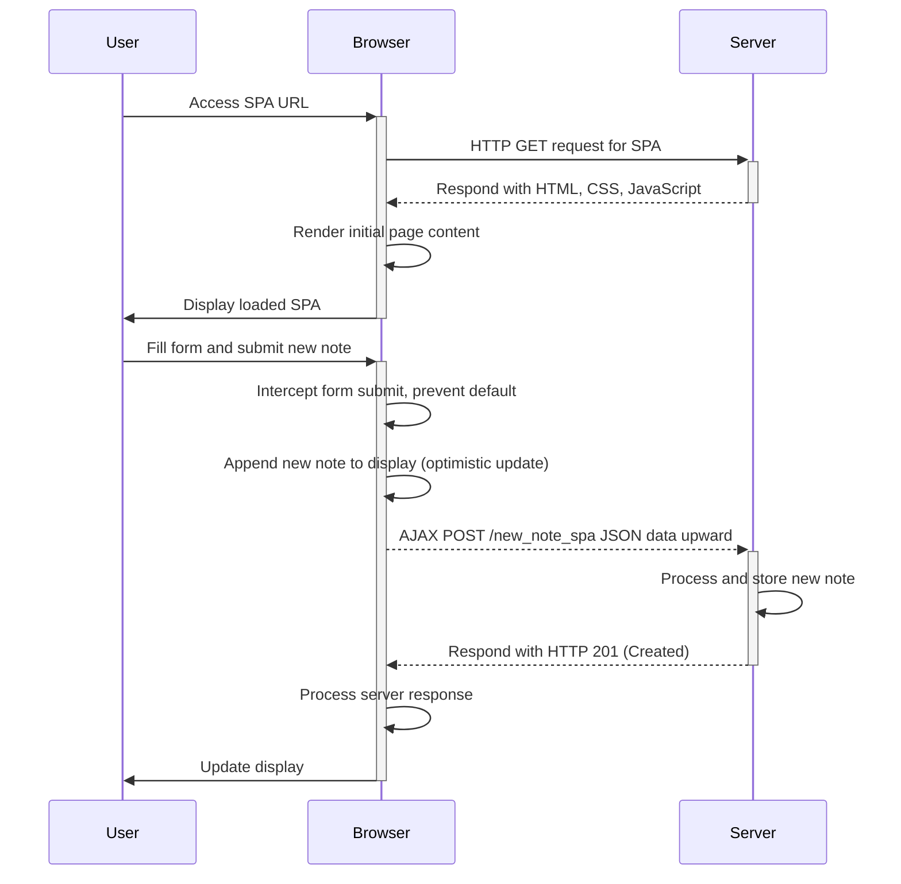

```mermaid
    sequenceDiagram
        participant User as User
        participant Browser as Browser
        participant Server as Server
    
        User->>+Browser: Access SPA URL
        Browser->>+Server: HTTP GET request for SPA
        Server-->>-Browser: Respond with HTML, CSS, JavaScript
        Browser->>Browser: Render initial page content
        Browser->>-User: Display loaded SPA
    
        User->>+Browser: Fill form and submit new note
        Browser->>Browser: Intercept form submit, prevent default
        Browser->>Browser: Append new note to display (optimistic update)
        Browser-->>+Server: AJAX POST /new_note_spa JSON data upward
        Server->>Server: Process and store new note
        Server-->>-Browser: Respond with HTTP 201 (Created)
        Browser->>Browser: Process server response
        Browser->>-User: Update display
```