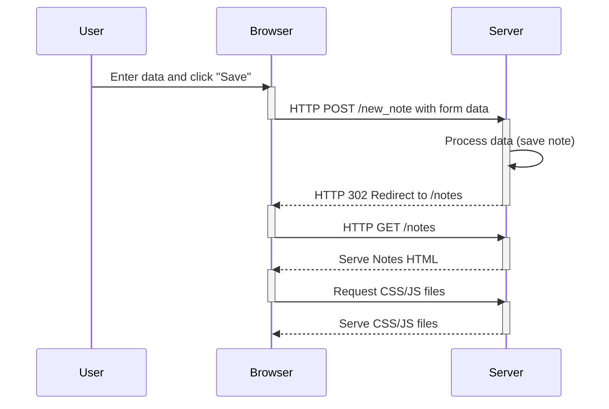

```mermaid
    sequenceDiagram
    participant User
    participant Browser
    participant Server

    User->>Browser: Enter data and click "Save"
    activate Browser
    Browser->>Server: HTTP POST /new_note with form data
    deactivate Browser
    activate Server
    Server->>Server: Process data (save note)
    Server-->>Browser: HTTP 302 Redirect to /notes
    deactivate Server
    activate Browser
    Browser->>Server: HTTP GET /notes
    deactivate Browser
    activate Server
    Server-->>Browser: Serve Notes HTML
    deactivate Server
    activate Browser
    Browser->>Server: Request CSS/JS files
    deactivate Browser
    activate Server
    Server-->>Browser: Serve CSS/JS files
    deactivate Server
```
